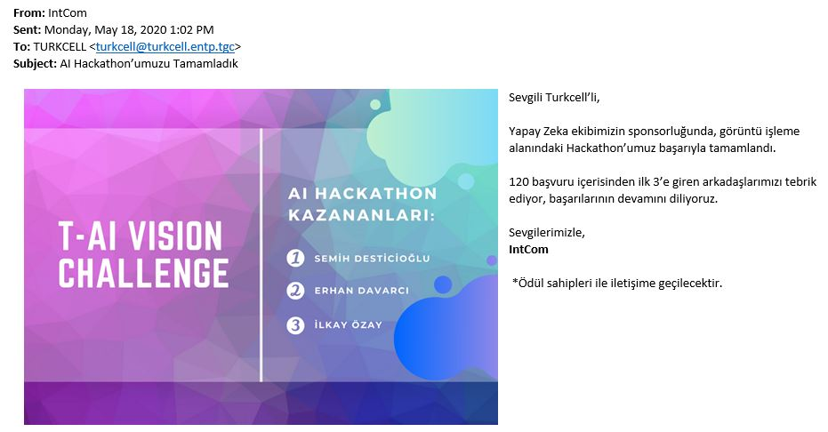

# Turkcell AI Vision Challenge Contest Project

Turkcell AI Vision Challenge competition was held in my company internally and I won the prize with my winning project.Out of 120 project, it is awarded as 1st. 

I created a CNN deep learning algorithm using Pytorch library and pre-trained Resnet-18 model with transfer learning approach. Main target was classifying images correctly.
There were data of 7 different kind of fruits and data is knowingly mixed with false images. 

## File descriptions

```t-ai-vision-challenge/
├── Fruit_Classification.ipynb  >> End-to-end analysis notebook with EDA.
├── inference.py                >> Prediction algorithm with trained model.
├── requirements.txt            >> Required libraries to run the model.
├── train.py                    >> Training algorithms and implementations.

```


 
